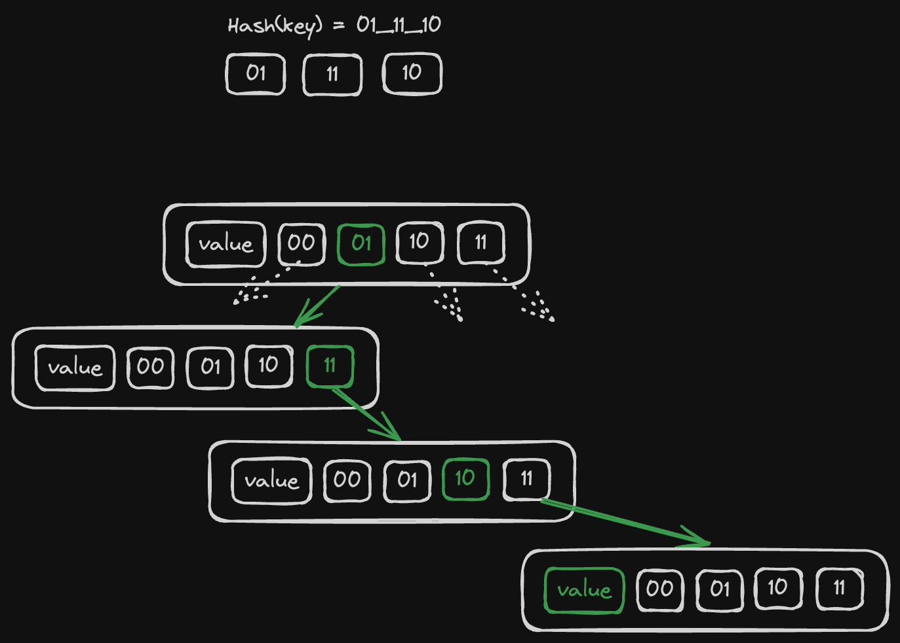

# Hashmaps

Hashmaps are more complex but what's important I only need something like a `HashSet<&str>` so the data structure doesn't really need to be intrusive. However, it should be arena-friendly and it must require 0 heap allocations.

I took inspiration from [this blog post](https://nullprogram.com/blog/2023/09/30/) (I highly recommend to go and read it, it explains this concept much better than me), the idea is that we'll pack our hash table as a tree where each node has 4 nullable children:

```rust
struct ArenaHashMap<'b, K, V>
where
    K: Copy + SimpleHash + PartialEq + 'b,
    V: Copy + 'b,
{
    children: UnsafeCell<[*const Self; 4]>,
    key: Cell<Option<K>>,
    value: Cell<V>,
    _marker: core::marker::PhantomData<&'b ()>,
    prev: Cell<Option<NonNull<Self>>>,
    next: Cell<Option<NonNull<Self>>>,
}

trait SimpleHash {
    fn simple_hash(self) -> usize;
}
```

1. again, our `ArenaHashMap` can't outlive the blob that lives for `'b`
2. I want it to store either primitives or arena-allocated references, so keys and values should be `Copy`
3. instead of using `core::hash::Hash` I decided to go with a simpler custom trait that just returns a plain number as a hashsum. Now I can easily implement it for `&str` and keep things simple.

Each node has 4 children and when we compute the hash of `K` we break it down to groups of 2 bits (that's 4 distinct values, that's why we have 4 children) and literally take a route from the root to the leaf that matches our byte groups. If some parts of the path do not exist we construct them on-the-fly.



So on each iteration we:

1. look at `children[h >> 62]`
2. do `h <<= 2` before jumping to the next iteration
3. we exit either once we reach an empty slot (then it's a new key), or once we get an existing node with the same hash + key.

If it's an existing slot we check for collision by comparing a key stored in the slot with the key that we insert and if they are not equal we just keep looping and creating new leafs. At the end it looks like a linked list with all key/value pairs having the same hash (visually this list goes "down" from a leaf node of the tree like an icicle. Well, technically it's also a part of the tree).

```rust
unsafe fn insert_unsafe(mut node: *mut *const Self, key: K, value: V) {
    let mut h = key.simple_hash();
    while let Some(node_ref) = (*node).as_ref() {
        if Some(key) == node_ref.key.get() {
            node_ref.value.set(value);
            return;
        }
        let children = UnsafeCell::raw_get(&node_ref.children)
            .as_mut()
            .unwrap();

        node = &mut children[h >> 62];
        h <<= 2;
    }
    *node = allocate_on_blob::<Self>();
    (**node).key.set(Some(key));
    (**node).value.set(value);
}

fn insert(hashmap: &mut &Self, key: K, value: V) {
    let root_node: *mut *const Self = unsafe { core::mem::transmute(hashmap) };
    unsafe { Self::insert_unsafe(root_node, key, value) };
}
```

`allocate_on_blob` here is just a stub for simplicity, I'll cover it one of the next chapters.

Lookup is trivial to implement, it has the same logic of iterating but returns an `Option<V>` instead of mutating.
