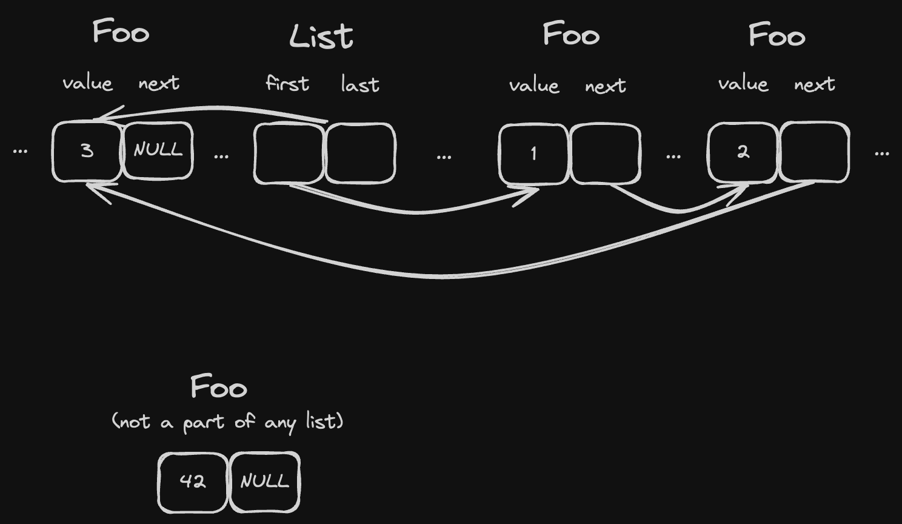

# Single linked list

For `T` to be an element of a single linked list it must store a pointer to `next` inside of `T`:

```rust
struct Foo {
    value: i32,
    next: Cell<Option<NonNull<Foo>>>
}
```

1. `Cell` here allows us to have interior mutability and modify its value via a `const` reference
2. `Option<NonNull<T>>` is just a safer way to have `*mut T`: we have to explicitly check for `None` instead of `is_null()`

And the list could look like this:

```rust
struct SingleLinkedIntrusiveList<'b, T>
where
    T: SingleLinkedIntrusiveListItem,
{
    first: Cell<Option<NonNull<T>>>,
    last: Cell<Option<NonNull<T>>>,
    _marker: core::marker::PhantomData<&'b ()>,
}
```

where:

1. `'b` is the lifetime of our arena. It shouldn't be possible for any arena-allocated structure to outlive the memory that it's located on.
2. `T: SingleLinkedIntrusiveListItem` is our constraint for elements of the list

```rust
trait SingleLinkedIntrusiveListItem {
    fn next(&self) -> Option<NonNull<Self>>;
    fn set_next(&self, new_next: Option<NonNull<Self>>);
}

impl SingleLinkedIntrusiveListItem for Foo {
    fn next(&self) -> Option<NonNull<Self>> {
        self.next.get()
    }

    fn set_next(&self, new_next: Option<NonNull<Self>>) {
        self.next.set(new_next)
    }
}
```

Operations like `.push(&'b Foo)` and `.pop()` are the same as for the "standard" linked list, but instead of writing `.next` to `List` elements we write them straight to `T` using `.set_next()`.



As a result, any `T: SingleLinkedIntrusiveListItem`:

1. can be added to any existing list at any time, and this operation doesn't require any additional memory.
2. can belong only to a single linked list. This requires a note that lists can "embed" each other and then elements can be "shared" (because their `next` pointer remains the same for both lists), and so operations like `list1.concat(list2)` can be easily implemented with no copying.
