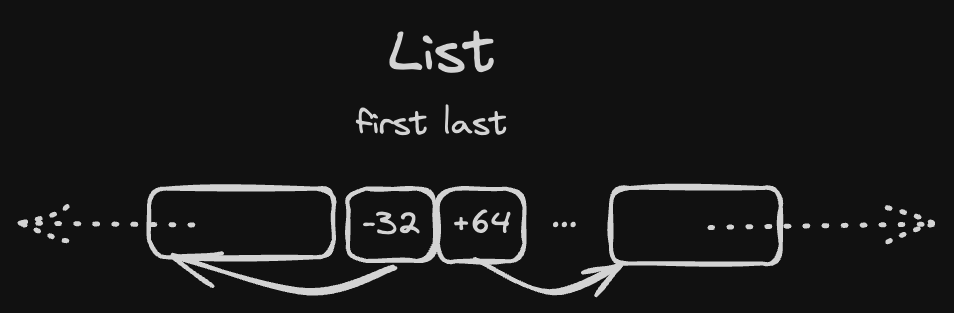

# Memory usage optimisations

First, it should be possible to allocate temporary data on a **different temporary arena** (let's call it `scratch`). It can be passed to parser-tokenizer-whatever-else-needs-memory and all one-time objects could be written there instead.

If we are fully cofident about the lifespan of these temporary objects we can go further and implement it as a circular buffer, so that old temporary data will be automatically overwritten with new temporary data.

Second, instead of using pointers we can use **relative offsets**. A single offset can be just a 32-bit signed integer, which allows us to:

1. have "links" in our data that are able to index 2GB left and 2GB right on arena (technically everything is 8-byte-aligned, so we can count in "words" and have 16GB both ways)
2. take twice less space (unless they have to be zero-padded because there are no fields to fill the gap)



These two `i32` offsets can be packed in a single word:

```rust
#[repr(transparent)]
struct PairOfOffsets<T> {
    // to enforce alignment = 8
    packed: Cell<usize>
    marker: core::marker::PhantomData<T>
}

impl<T> PairOfOffsets<T> {
    fn set_first(&self, ptr: *T) {
        let [_, last]: [i32; 2] = transmute(self.packed.get());
        let new_first = ptr.offset_from(self as const *Self);
        self.packed.set(transmute([new_first, last]))
    }

    fn first<'b>(&self) -> Option<&'b T> {
        let [first, _]: [i32; 2] = transmute(self.packed.get());
        first.as_ref()
    }
}
```

It can be zero-initialized (in such case both refs are `None`) and it takes only 8 bytes.

1. `List<T>` with this optimisation takes 1 word instead of 2
2. `HashMap` can have an array of 2 `PairOfOffsets` instead of 4 pointers to maintain a tree structure (which saves us two words per node)
