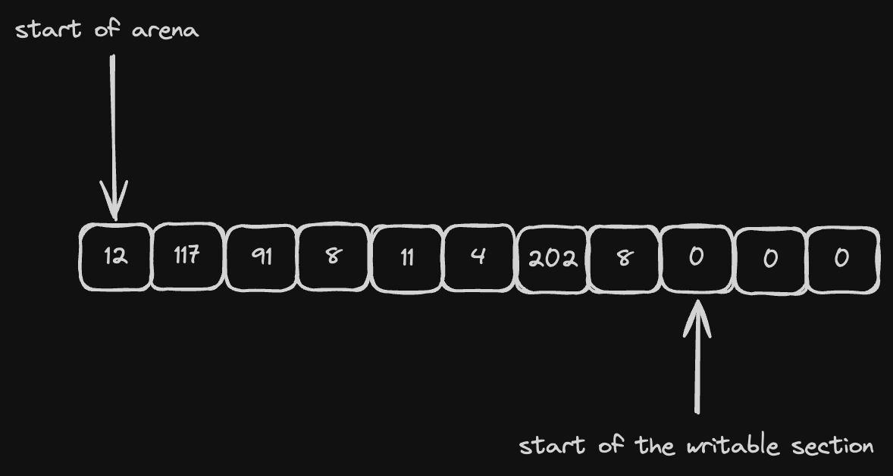

# What is arena allocator

> An allocator is a library that allows your program to dynamically allocate and release memory.

These days most widely used allocator are global, i.e. they are configured once for the whole program and they provide functions like `malloc`, `free` (and possibly some optimised versions of `calloc` and friends) for memory management. You might've heard of some of them:

+ `glibc` allocator
+ `jemalloc`
+ `tcmalloc`
+ `mimalloc`

They all have their own unique properties (general availability/specific performance traits/better tracing/etc) but they all share something in common: they are globally set. You can't easily "swap" allocators at runtime unless your code is written specifically to support it (like it's done in Zig for example).

Arena allocators on the other side are usually "local" to your code, i.e. they have to be passed explicitly to the code that wants to allocate a chunk of memory.

A single arena allocator holds a reference to (usually a single) pre-defined raw blob of memory. It can point to a heap-allocated vector or to a stack-allocated array, it really doesn't matter. As a result our `malloc` and `free` functions are somewhat special:

+ `malloc` simply "cuts" requested amount of memory from the blob
+ `free` is not even needed, the memory is automatically released once the blob is deleted

So to allocate a struct that takes N bytes we need to:

1. add N to our write pointer
2. return `write pointer - N` (initial value)

Of course it also requires alignment handling but for now it's out of scope. It will be covered later in the implementation section.

To release memory we simply release the blob itself, so it's like a batched deallocation, sort of. The consequence here is that all of our types must be:

1. trivially copyable (`: Copy` if we speak in Rust)
2. trivially destructible (i.e. they can't have `impl Drop`)

Both of this constraints are fine for my use-case.
